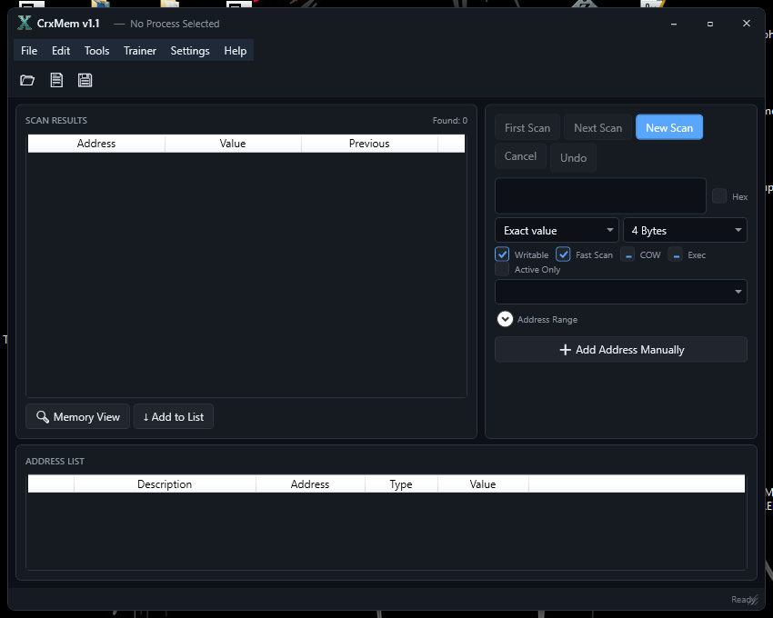

# CrxMem - Main Application

> **Part of the [CrxMem Suite](../README.md)**

The main memory scanner and debugger GUI application. Built with .NET 8.0 using WPF and WinForms for a modern, dark-themed interface.



---

## IMPORTANT: Project Status

> **This project is currently under active development.** Many features are still being implemented, refined, or are in experimental stages. Expect bugs and incomplete functionality.

### Known Issues & Work In Progress

| Feature | Status | Notes |
|---------|--------|-------|
| **Find What Writes/Accesses** | Buggy | Detection may miss some memory accesses |
| **Debugger** | In Development | Core functionality works, advanced features incomplete |
| **Breakpoints** | In Development | Hardware breakpoints partially implemented |
| **Lua Engine** | Incomplete | Core functions work, full API not yet finished |
| **UI Improvements** | Planned | Various polish and enhancements coming |

### Upcoming Features
- Complete debugger with full breakpoint support
- Enhanced memory access detection reliability
- Comprehensive Lua scripting API
- Improved pointer scanner
- Memory region comparison
- Advanced signature scanning
- Structure dissector
- And much more...

---

## Features

### Core Memory Operations
- **Memory Scanning** - Search for values in process memory
  - Exact value, increased/decreased, changed/unchanged, unknown initial value
  - Value between ranges
  - Support for Byte, 2 Bytes, 4 Bytes, 8 Bytes, Float, Double, String, and AOB (Array of Bytes)
- **Memory Editing** - Modify values in real-time
- **Address Freezing** - Lock values to prevent changes
- **Pointer Scanning** - Find pointer chains to dynamic addresses
- **Undo Scan** - Revert to previous scan results

### Memory Analysis
- **Memory View** - Hex editor with real-time memory visualization
- **Disassembler** - x86/x64 disassembly powered by the Iced library
- **PE Analysis** - Analyze executable headers, sections, imports, and exports
- **Module Browser** - View loaded modules and their memory regions

### Debugging (Work in Progress)
- **Find What Writes/Accesses** - Monitor memory access patterns
- **Hardware Breakpoints** - Set breakpoints without modifying code
- **VEH Debugging** - Vectored Exception Handler based debugging
- **Debug Monitor** - Real-time debugging information display

### Scripting (Work in Progress)
- **Lua Engine** - Automate tasks with Lua scripting
  - Memory read/write functions
  - Process manipulation
  - GUI creation for custom tools
  - Scan automation
- **Script Editor** - Built-in editor with syntax highlighting

### Additional Tools
- **Anti-Cheat Bypass Lab** - Experimental anti-cheat research tools
- **DLL Injection Test** - Test DLL injection methods
- **Cheat Table Support** - Save and load address lists

### User Interface
- **Modern Dark Theme** - Easy on the eyes
- **WPF + WinForms Hybrid** - Best of both frameworks
- **Customizable Hotkeys** - Configure keyboard shortcuts
- **Live Value Updates** - Real-time value refreshing

---

## Requirements

- **OS:** Windows 10/11 (64-bit)
- **.NET:** .NET 8.0 Runtime
- **Optional:** CrxShield kernel driver for enhanced memory access

---

## Installation

### From Release
1. Download the latest release from the [Releases](https://github.com/ZxPwdz/CrxMem/releases) page
2. Extract to a folder of your choice
3. Run `CrxMem.exe`

### Building from Source
1. Clone the repository
   ```bash
   git clone https://github.com/ZxPwdz/CrxMem.git
   cd CrxMem
   ```

2. Build with .NET CLI
   ```bash
   dotnet build -c Release
   ```

3. Output will be in `bin/Release/net8.0-windows/`

---

## Usage

### Basic Memory Scanning
1. Click **File > Open Process** or use the toolbar button
2. Select the target process from the list
3. Enter the value you want to find
4. Select the appropriate **Value Type** (4 Bytes for integers, Float for decimals)
5. Click **First Scan**
6. Change the value in the target application
7. Enter the new value and click **Next Scan**
8. Repeat until you find the correct address(es)
9. Double-click an address to add it to your Address List

### Using the Address List
- **Double-click** an address to edit its value
- **Check the box** to freeze the value
- **Right-click** for context menu options

### Saving Your Work
- **File > Save Table** to save your address list
- **File > Load Table** to restore a previous session

---

## Project Structure

```
CrxMem/
├── Core/                    # Core functionality
│   ├── MemoryScanner.cs     # Memory scanning engine
│   ├── ProcessAccess.cs     # Process memory read/write
│   ├── DebugMonitor.cs      # Debugging functionality
│   ├── PEAnalyzer.cs        # PE file analysis
│   └── ...
├── LuaScripting/            # Lua engine integration
│   ├── LuaEngine.cs         # Main Lua engine
│   ├── LuaMemoryFunctions.cs
│   ├── LuaGuiFunctions.cs
│   └── ...
├── MemoryView/              # Memory visualization
│   ├── MemoryViewForm.cs    # Hex editor form
│   ├── DisassemblerViewControl.cs
│   ├── HexViewControl.cs
│   └── ...
├── Legacy/                  # Legacy WinForms UI
├── Themes/                  # WPF themes and styles
├── MainWindow.xaml          # Main WPF window
└── MainWindow.xaml.cs       # Main window logic
```

---

## Related Projects

CrxMem works together with these companion projects:

| Project | Description |
|---------|-------------|
| [CrxShield](https://github.com/ZxPwdz/CrxShield) | Kernel driver for enhanced memory access |
| [VEHDebugDll](https://github.com/ZxPwdz/VEHDebugDll) | VEH-based debugging DLL for injection |

---

## Tech Stack

- **Language:** C# (.NET 8.0)
- **UI Framework:** WPF + Windows Forms
- **Disassembler:** [Iced](https://github.com/icedland/iced) - x86/x64 disassembler
- **Scripting:** [NLua](https://github.com/NLua/NLua) - Lua scripting for .NET
- **UI Components:** [ReaLTaiizor](https://github.com/Developer-Flavor/ReaLTaiizor) - Modern WinForms controls

---

## Disclaimer

This software is provided for **educational and research purposes only**. The author is not responsible for any misuse of this software. Always ensure you have permission to analyze and modify the memory of any application.

---

## License

MIT License

---

**Created by ZxPwdz**
